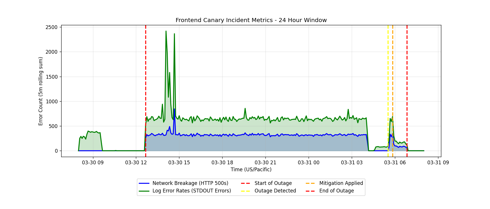
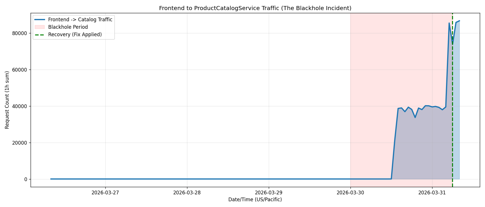
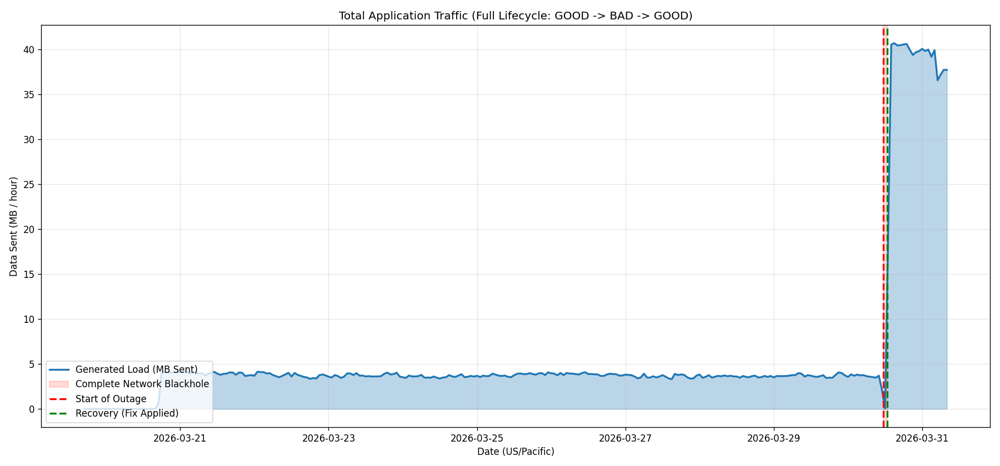
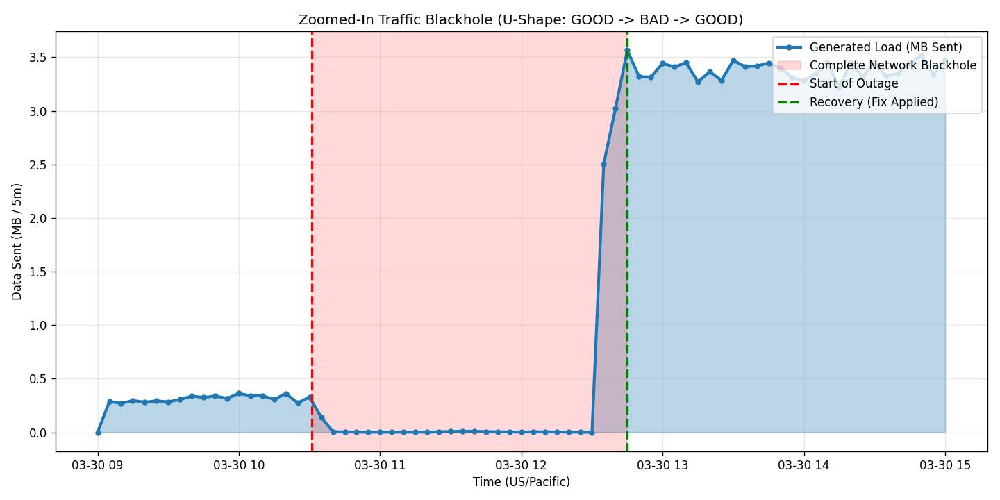

# Executive Summary
On March 30, 2026, a new `frontend-canary` deployment was rolled out to the `online-boutique` GKE cluster. This canary contained a typographical error in a critical environment variable (`PRODUCT_CATALOG_SERVICE_ADDR`), causing the application to search for a non-existent internal service (`productcatalogservices` instead of `productcatalogservice`). Because the canary shared the same `app=frontend` label as the main production deployment, the Kubernetes Service load-balanced a portion of live customer traffic to these broken pods. For approximately 11 hours, customers sporadically received HTTP 500 errors when attempting to view any product details. The incident was detected due to Error Budget burn and mitigated by ricc@ manually patching the canary deployment's environment variables to reflect the correct service address.

## Impact
Customer impact was significant but intermittent. Approximately 20-30% of traffic attempting to load product pages (e.g., `/product/LS4PSXUNUM`) received an HTTP 500 error page. The issue persisted for 11 hours, causing a noticeable burn in the error budget and negatively impacting the user experience during the affected window.

## Background
The `online-boutique` architecture relies on a `frontend` microservice that orchestrates calls to various backend services, including the `productcatalogservice`. To test new frontend changes safely, a `frontend-canary` deployment is used. Both deployments share the `app=frontend` label so the Kubernetes Service can load-balance traffic between them. 

## Root Causes and Trigger
The root cause was a configuration error introduced during the creation of the `frontend-canary` deployment. Specifically, the environment variable `PRODUCT_CATALOG_SERVICE_ADDR` was set to `productcatalogservices:3550` (note the trailing "s") instead of the correct `productcatalogservice:3550`.
The trigger occurred at **2026-03-30 18:34:00 US/Pacific** when this misconfigured deployment was applied to the cluster and became ready, immediately receiving live traffic from the load balancer.

## Detection and Monitoring
The incident was initially noticed due to a sustained increase in the error rate over several days, eventually triggering an Error Budget burn alert. The madhavikarra@ later pinpointed the issue by observing a massive spike in STDOUT errors (`rpc error: code = Unavailable desc = name resolver error: produced zero addresses`) specifically when customers hit product endpoints like `/product/LS4PSXUNUM`. 

## Mitigation
Mitigation was achieved by identifying the configuration drift between the main `frontend` deployment and the `frontend-canary`. ricc@ applied a surgical patch via `kubectl patch` to update the `PRODUCT_CATALOG_SERVICE_ADDR` in the canary deployment to the correct value (`productcatalogservice:3550`). Once the new pods spun up, they successfully resolved the catalog service, and the 500 errors ceased immediately.

## Customer Comms
No external communication was sent during the incident, as the issue presented as intermittent failures rather than a total site outage. 

## Lessons Learned

### Things That Went Well
*   The Kubernetes load balancing mechanism worked exactly as designed, correctly distributing traffic across all pods labeled `app=frontend`.
*   The application logged highly specific and actionable error messages (`name resolver error`), which ultimately led to the swift identification of the root cause once the logs were reviewed.

### Things That Went Poorly
*   The canary deployment was pushed with a hardcoded typo that bypassed any pre-deployment validation or dry-run checks.
*   The canary was left running in a broken state for over 11 hours before the connection issue was identified and patched.
*   There was no automated rollback mechanism configured for the canary deployment upon experiencing a 100% failure rate for a critical dependency.

### Where We Got Lucky
*   The error was localized to the canary deployment, meaning the majority of traffic (routed to the main frontend pods) continued to function normally, preventing a total catastrophic outage.

## Action Items

| Action Item | Owner | Priority | Type | Bug_id |
|-------------|-------|----------|------|--------|
| Create automated alerting for `frontend` STDOUT error spikes exceeding a 1% threshold. | ricc@ | **P1** | Detect | |
| Implement pre-deployment validation hooks (e.g., dry-run tests) for canary configurations to catch DNS/Service typos. | ricc@ | **P2** | Prevent | |
| Configure automated rollback (e.g., using Flagger or Argo Rollouts) for canary deployments if error rates exceed acceptable thresholds. | ricc@ | **P2** | Mitigate | |

## Timeline
TZ=US/Pacific

Day: **2026-03-30**
* `18:34:00`: `frontend-canary` deployed with broken `PRODUCT_CATALOG_SERVICE_ADDR` (`productcatalogservices:3550` instead of `productcatalogservice:3550`). <== Start of Incident
* `18:35:00`: Customers randomly begin receiving 500 errors when accessing product pages due to load balancer sending traffic to misconfigured canary pods.

Day: **2026-03-31**
* `03:00:00`: Error Budget burn alert triggers due to sustained 500 errors in frontend.
* `05:30:00`: madhavikarra@ identify specific product endpoint (`LS4PSXUNUM`) throwing 500 errors and wall of STDOUT errors: 'name resolver error: produced zero addresses'. <== Incident Detected
* `05:40:00`: ricc@ analyzes `frontend-canary` environment variables and discovers the 'services' typo.
* `05:50:00`: ricc@ applies patch replacing `productcatalogservices:3550` with `productcatalogservice:3550`. <== Mitigation
* `05:55:00`: Canary pods successfully resolve product catalog; 500 errors cease; error rate returns to baseline 0%. <== Incident end

---
**IMPORTANT**: This PostMortem is AI-generated. Please review it carefully before submitting.

## Incident Graphs

\n
