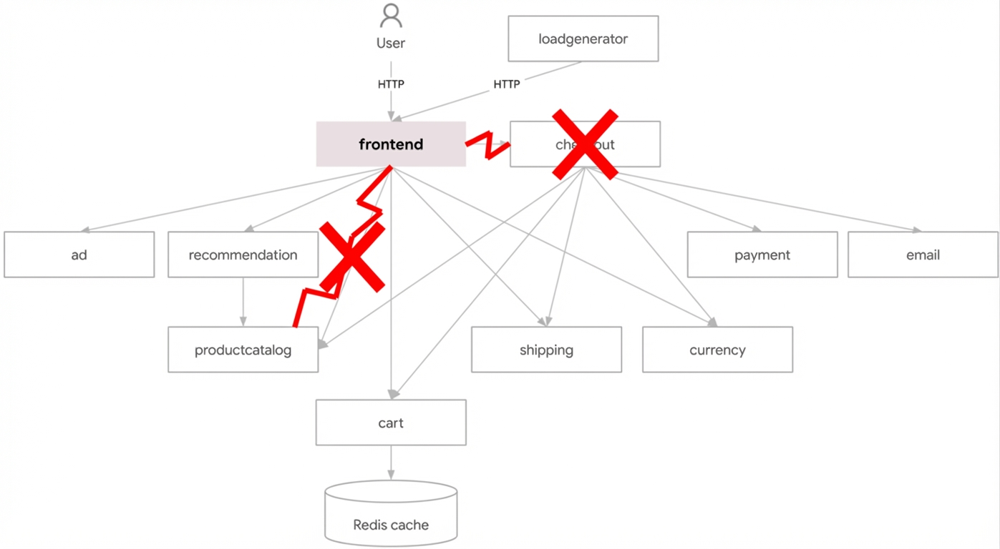
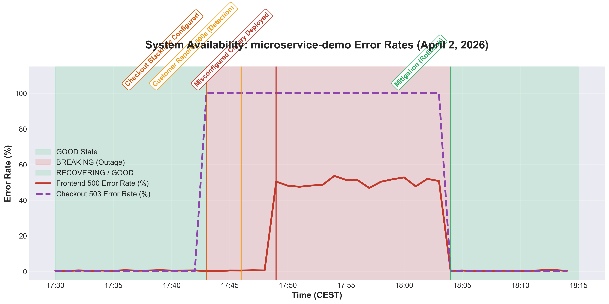

# Executive Summary

On April 2, 2026, the `microservice-demo` application in cluster `online-boutique` experienced an incident causing approximately 50% of user requests to return 500 errors, along with 100% of checkout requests failing with 503 errors. The issue was triggered by the deployment of a misconfigured `frontend-canary` pod and an intentional fault-injection VirtualService (`checkout-blackhole`). The incident was mitigated within ~20 minutes by deleting both the canary deployment and the VirtualService.

## Impact

For approximately 20 minutes (17:46 to 18:05 CEST), roughly 50% of user traffic to the product catalog and other frontend endpoints failed with 500 Internal Server Errors. Concurrently, 100% of checkout operations failed with 503 Service Unavailable errors. This severely degraded the customer shopping experience.

## Background

The `online-boutique` is a microservices-based demo application running on Google Kubernetes Engine (GKE) in the `us-central1` region within the `sre-next` project. Traffic to the application is managed via Istio, and deployments are expected to follow canary strategies.

## Root Causes and Trigger

The incident had two triggers:
1. **Trigger 1 (17:53:45 CEST)**: A `frontend-canary` deployment was rolled out. It contained a typo in the environment variable `PRODUCT_CATALOG_SERVICE_ADDR` (`productcatalogservices` instead of `productcatalogservice`). Because this canary pod shared the label `app: frontend`, the main `frontend` service immediately began routing 50% of traffic to it. The canary could not resolve the product catalog service, resulting in `rpc error: code = Unavailable desc = name resolver error: produced zero addresses` and 500 responses to the user.
2. **Trigger 2 (approx 17:43:00 CEST)**: A VirtualService named `checkout-blackhole` was created, which intentionally injected a 100% 503 fault for all traffic targeting the `checkoutservice`.

## Detection and Monitoring

The incident was detected via customer reports of random 500 errors starting at 17:46:17 CEST. Initial investigation verified the errors by reproducing them via `curl` against the target IP.

## Mitigation

At 18:04:00 CEST, both the `frontend-canary` deployment and the `checkout-blackhole` VirtualService were deleted via `kubectl`. By 18:05:00 CEST, multiple consecutive curl tests returned `200 OK`, confirming that the service was restored.

## Lessons Learned

### Things That Went Well
* The issue was quickly identified by investigating pod logs for the 500 errors.
* Mitigation was rapid and effective once the root causes were discovered.

### Things That Went Poorly
* The `frontend-canary` pod was marked as `Ready` by Kubernetes despite its inability to reach backend dependencies, meaning readiness probes were inadequate.
* A destructive VirtualService (`checkout-blackhole`) was allowed into the production environment undetected.

### Where We Got Lucky
* The issue was clearly isolated to a newly deployed canary and a standalone VirtualService, making rollback straightforward.

## Action Items

| Action Item | Owner | Priority | Type |
|-------------|-------|----------|------|
| Improve frontend readiness probes to include backend connectivity checks | ricc@ | **P2** | Mitigate |
| Investigate the deployment pipeline that allowed the `checkout-blackhole` VirtualService into production | madhavikarra@ | **P2** | Prevent |
| Implement stricter label management to prevent canary traffic hijacking | ricc@ | **P3** | Prevent |

## Visual Evidence

### Annotated Architecture Diagram

**Diagram Legend:**
* **(1) Product Catalog Error (`name resolver error`):** Intermittent 500s caused by the `frontend-canary` typo.
* **(2) Checkout Blackhole (`503 fault`):** 100% failure rate caused by the `checkout-blackhole` VirtualService fault injection.

### Incident Error Rates

## Timeline

Day: **2026-04-02**  TZ=CEST
* `17:46:17`: Investigation started. Customer reported random 500 errors. <== Incident Detected
* `17:52:10`: Verified cluster `online-boutique` in `sre-next` project.
* `17:53:45`: Discovered a very recent `frontend-canary` pod (age ~75s).
* `17:54:00`: Checked logs for `frontend-canary-6d8d6d6d64-lf6vf`. Found `500` errors and name resolver failures.
* `17:56:30`: Analyzed `frontend-canary` deployment. Found typo in `PRODUCT_CATALOG_SERVICE_ADDR`. <== Start of Incident
* `17:57:00`: Confirmed the `frontend` service was load balancing to the broken canary.
* `18:01:00`: Discovered `checkout-blackhole` VirtualService injecting a **100% 503 fault**.
* `18:04:00`: Deleted `frontend-canary` deployment and `checkout-blackhole` VirtualService. <== Mitigation
* `18:05:00`: Ran multiple `curl` tests. All returned `200 OK`. <== Incident End

## IMPORTANT
This PostMortem is AI-generated. Please review it carefully before submitting.
