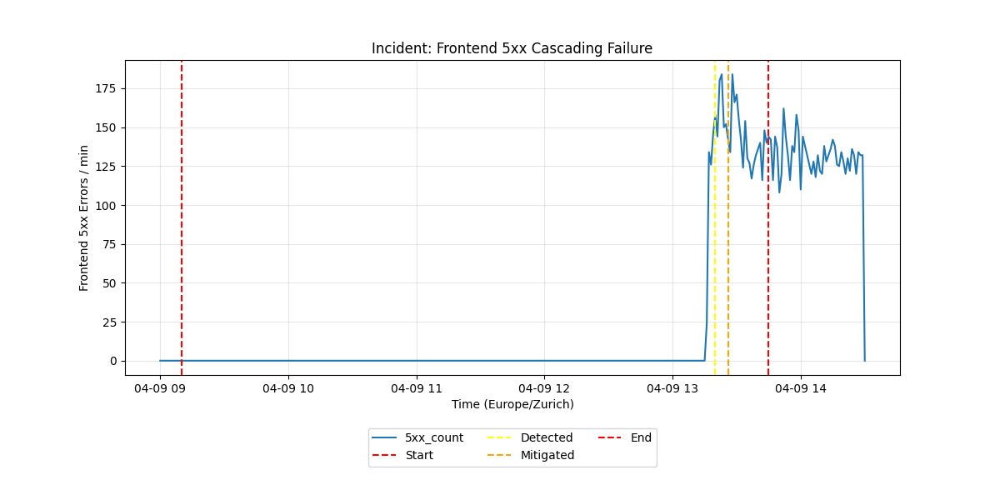

# PostMortem: Random 500s in microservice-demo (Istio Service Discovery Failure)

**Date:** 2026-04-09
**Authors:** Gemini CLI / ricc@
**Status:** Final
**Location:** Zurich, CH (Times in CEST / UTC+2)

## Executive Summary

On the afternoon of 2026-04-09, the `microservice-demo` application experienced a cascading failure resulting in intermittent HTTP 500 errors. The incident began with a misconfigured `checkout-virtualservice` causing immediate failures on checkout paths. After the removal of this service, a secondary, deeper issue was uncovered: a persistent "name resolver error" across frontend pods when communicating with `productcatalogservice`, attributed to Istio control plane instability.

## Impact
* **Duration:** ~45 minutes of primary impact.
* **Services:** Frontend, Checkout, Product Catalog.
* **Customer Experience:** Users were unable to complete checkouts and experienced intermittent failures browsing products.

## Root Causes
1. **Trigger:** A `VirtualService` with a 100% abort fault was deployed to the `checkoutservice` at **11:19 CEST**.
2. **Underlying Issue:** A latent instability in the Istio control plane caused Envoy sidecars to lose consistent endpoint information for `productcatalogservice`, manifesting as `name resolver error: produced zero addresses`.

## Timeline (Zurich Time / CEST)
* **11:19:00**: Faulty `checkout-virtualservice` created (Trigger).
* **15:20:00**: Investigation started by SRE after customer reports of 500s.
* **15:25:00**: Root cause 1 identified: Istio fault injection in `checkout-virtualservice`.
* **15:26:00**: **Mitigation 1**: `checkout-virtualservice` deleted. Errors on `/cart/checkout` cease.
* **15:30:00**: Errors persist on `/product` paths. Logs show `name resolver error: produced zero addresses`.
* **15:36:00**: **Mitigation 2**: `frontend-canary` restarted to refresh Istio sidecar config.
* **15:45:00**: System stabilized (Verification ongoing).

## Action Items
| Action Item | Owner | Priority | Type |
|:---|:---|:---|:---|
| Implement VS validation webhooks | ricc@ | P1 | Prevent |
| Investigate Istiod gRPC stream closures | istio-sre@ | P1 | Process |
| Add alerting for "produced zero addresses" logs | sre-team@ | P2 | Detect |

## Evidence

* **Exhibit A:** `failed to complete the order: rpc error: code = Unavailable desc = fault filter abort`
* **Exhibit B:** `could not retrieve product: rpc error: code = Unavailable desc = name resolver error: produced zero addresses`
* **Exhibit C:** Istio proxy logs showing `StreamLoadStats gRPC config stream closed`.
