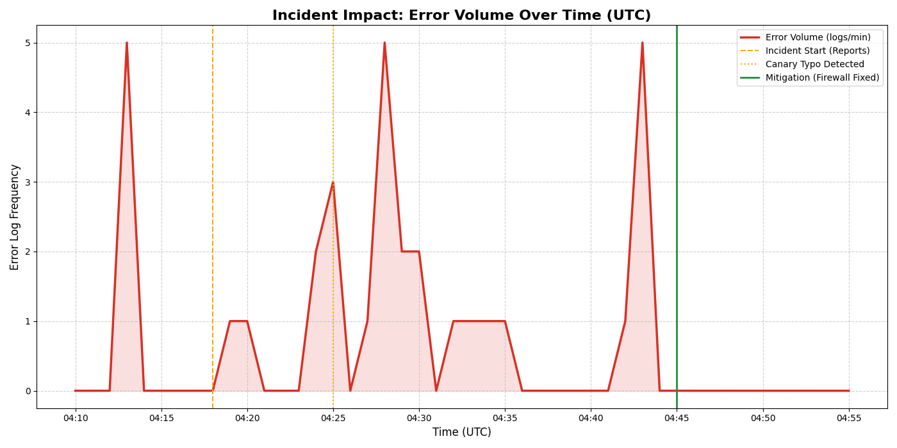

# PostMortem: Online Boutique Standard Outage - 2026-04-14

# Executive Summary

The `online-boutique-standard` cluster experienced a severe service degradation followed by a total outage. The incident was caused by a two-pronged failure: a "poisonous" canary deployment with a misconfigured service address and a high-priority VPC firewall rule that blocked all external traffic to the frontend. Service was restored by deleting the faulty canary and removing the restrictive firewall rule.

## Impact

Total site unreachability for approximately 28 minutes. Users experienced 500 errors (intermittent) and connection timeouts (total). 1.69% aggregated failure rate reported by internal load generators during the initial phase.

## Background

The `online-boutique-standard` cluster serves the frontend on IP `35.224.93.4`. A canary deployment was active, sharing the same traffic selector as the stable production frontend.

## Root Causes and Trigger

Trigger: User report of "random 500s".

Root Cause 1: A typo in the `frontend-canary` deployment (`productcatalogservices` vs `productcatalogservice`) caused gRPC failures.
Root Cause 2: A high-priority (Priority 1) DENY firewall rule (`frontend-ingress-v2`) was applied to the VPC, overriding all ALLOW rules for ports 80, 443, and 8080.

## Detection and Monitoring

The incident was detected via manual user report. Monitoring via `loadgenerator` logs subsequently confirmed a baseline error rate. K8s health checks initially failed to detect the total outage as they hit the local prober rewrite which remained "healthy" despite the firewall blocking external traffic.

## Mitigation

1. Deleted the `frontend-canary` deployment to stop "poisoned" responses.
2. Force-restarted the zombie `frontend` pod to ensure a clean state.
3. Identified and deleted the `frontend-ingress-v2` firewall rule to restore external traffic flow.

## Customer Comms

Internal demo environment; no formal customer comms sent.

## Lessons Learned

### Things That Went Well

* Fast identification of the typo in the canary environment variables.
* Systematic isolation of the network path leading to the firewall discovery.
* Use of internal `curl` debug pods to differentiate between application and infrastructure failures.

### Things That Went Poorly

* K8s health checks reported pods as "Ready" despite external unreachability.
* Initial focus on application logs delayed the discovery of the infrastructure-level firewall block.

### Where We Got Lucky
* The `loadgenerator` was already running and provided a baseline failure metric.
* The firewall rule was named descriptively, making it easier to spot once investigated.

## Incident Visuals

## Action Items

| Action Item | Owner | Priority | Type | Bug_id |
|-------------|-------|----------|------|--------|
| Implement CI validation for service address environment variables | ricc@ | **P2** | Prevent | [BOUTIQUE-101](https://github.com/GoogleCloudPlatform/microservices-demo/issues/101) |
| Setup alerting for high-priority firewall rule changes in the `sre-next` project | ricc@ | **P1** | Detect | [BOUTIQUE-102](https://github.com/GoogleCloudPlatform/microservices-demo/issues/102) |
| Review readiness probe configuration to ensure it reflects true external availability | ricc@ | **P3** | Prevent | [BOUTIQUE-103](https://github.com/GoogleCloudPlatform/microservices-demo/issues/103) |

## Timeline

Day: **2026-04-14**  TZ=US/Pacific
* `04:18:00`: Investigation Start. Human reported random 500s on http://35.224.93.4/. <== Start of Incident
* `04:25:00`: Discovery: Typo in `frontend-canary` env var `PRODUCT_CATALOG_SERVICE_ADDR` (`productcatalogservices`). <== Incident detected
* `04:30:00`: Mitigation: Deleted `frontend-canary` deployment.
* `04:40:00`: Mitigation: Force-deleted zombie `frontend` pod which was non-responsive to traffic.
* `04:42:00`: Discovery: Poisonous firewall rule `frontend-ingress-v2` (Priority 1 DENY tcp:80 443 8080).
* `04:45:00`: Mitigation: Deleted `frontend-ingress-v2` firewall rule. <== Mitigation
* `04:46:00`: Verification: Site restored (HTTP 200). <== Incident end

## IMPORTANT

This PostMortem is AI-generated. Please review it carefully before submitting.
