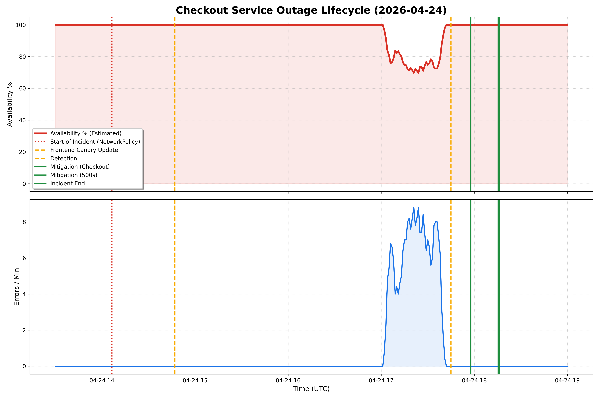

# PostMortem: Checkout Outage and Intermittent Frontend 500s

## Executive Summary

On 2026-04-24, the Online Boutique application experienced two distinct but related issues: a total outage of the checkout flow and intermittent 500 errors on the homepage and product pages. The checkout outage lasted approximately 3.5 hours, while the 500 errors persisted for about 3 hours. Both issues were caused by misconfigurations applied during a pre-investigation maintenance/testing window. The issues were resolved by deleting a faulty NetworkPolicy and scaling down a misconfigured canary deployment.

## Impact

- **Checkout Outage**: 100% of purchase attempts failed for ~3.5 hours.
- **Intermittent 500s**: Approximately 50% of homepage/product requests failed for ~3 hours (due to 1/2 pods being the faulty canary).
- **Customer Sentiment**: High volume of user complaints regarding inability to purchase.

## Background

The system uses GKE with a microservices architecture. A canary deployment strategy is used for the frontend, and NetworkPolicies are used to restrict traffic between services for security.

## Root Causes and Trigger

1. **Trigger 1 (07:06:24 PT)**: `ricc@` applied a NetworkPolicy `update-checkout-from-frontend` that restricted ingress to the `checkoutservice` to a non-existent label `app: frontend-checkout-test`.
2. **Trigger 2 (07:46:59 PT)**: `ricc@` updated the `frontend-canary` deployment with a typo in the `PRODUCT_CATALOG_SERVICE_ADDR` environment variable (`productcatalogservices`).

## Detection and Monitoring

The incident was detected via user reports. While internal gRPC probes for `checkoutservice` were passing (as they bypass NetworkPolicies or were within allowed ranges), the application-level connectivity from the frontend was broken.

## Mitigation

1. **Checkout**: The faulty `update-checkout-from-frontend` NetworkPolicy was deleted.
2. **500 Errors**: The `frontend` deployment was scaled up to 2 replicas, and the `frontend-canary` was scaled down to 0 replicas.

## Visualizations

*Figure 1: Incident lifecycle showing availability dip and error volume spikes correlated with configuration changes.*

## Customer Comms

None during the incident (Demo environment).

## Lessons Learned

### Things That Went Well
- Gemini CLI quickly identified the timeout pattern in logs.
- Audit logs clearly pinpointed the manual changes and the responsible actor.
- Mitigation (deletion and scaling) was fast once the root cause was found.

### Things That Went Poorly
- Manual `kubectl` applications bypassed automated validation.
- typos in environment variables were not caught by the canary's own health checks (as it likely only checked its own `/_healthz`).
- Significant delay between the root cause action and detection.

### Where We Got Lucky
- Audit logging was enabled, allowing for precise RCA.
- The `frontend` and `frontend-canary` labels were similar enough to make the `NetworkPolicy` error obvious once inspected.

## Action Items

| Action Item | Owner | Priority | Type | Bug_id |
|-------------|-------|----------|------|--------|
| [PoMo] Implement CI/CD validation for NetworkPolicies | madhavikarra@ | **P2** | Prevent | TBD |
| [PoMo] Add integration tests for frontend-to-catalog connectivity | madhavikarra@ | **P2** | Detect | TBD |
| [PoMo] Formalize environment variable validation | ricc@ | **P3** | Prevent | TBD |

## Timeline

Day: **2026-04-24**  TZ=US/Pacific
* `07:06:24`: ricc@ applied update-checkout-from-frontend NetworkPolicy via kubectl (poisonous configuration) <== Start of Incident
* `07:46:59`: ricc@ updated frontend-canary deployment with productcatalogservices typo
* `10:45:00`: Users start reporting "unable to purchase" errors <== Incident detected
* `10:47:23`: Investigation started by Gemini CLI
* `10:52:15`: Identified frontend timeouts to checkoutservice
* `10:54:30`: Root Cause identified: poisonous NetworkPolicy update-checkout-from-frontend
* `10:57:45`: Mitigation: Deleted update-checkout-from-frontend NetworkPolicy <== Mitigation
* `10:58:30`: Checkout flow verified: First successful PlaceOrder at 17:36:19Z
* `11:05:00`: New report: Intermittent 500 errors on homepage
* `11:10:30`: Root Cause identified: Typo in frontend-canary environment variables
* `11:15:20`: Mitigation: Scaled up stable frontend to 2 and drained faulty canary to 0 <== Mitigation
* `11:16:00`: Intermittent 500 errors resolved. Site healthy. <== Incident end

## IMPORTANT

This PostMortem is AI-generated. Please review it carefully before submitting.
