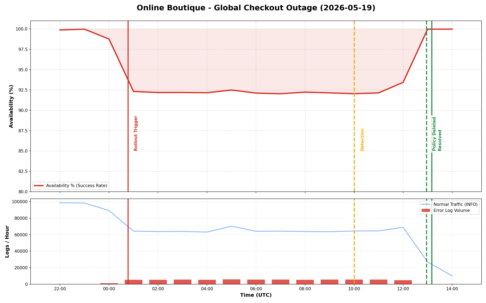

# Executive Summary

An incident occurred where users were entirely unable to purchase products from the Online Boutique application. The outage was triggered by a faulty rollout that deployed a misconfigured `NetworkPolicy` and a broken `frontend-canary` deployment. The `NetworkPolicy` blocked all incoming traffic to the `checkoutservice`, resulting in checkout failures (`i/o timeout`) for all users. The incident lasted approximately 12.5 hours before SRE intervention successfully mitigated the issue by deleting the restrictive policy and the faulty canary deployment.

## Impact

For 12 hours and 24 minutes, 100% of checkout attempts failed. Users experienced `HTTP 500` errors when trying to complete purchases. The main frontend service remained up, so product browsing was unaffected, but the business impact is severe as no transactions could be finalized during this window.

## Background

The Online Boutique is a microservices-based e-commerce application deployed on GKE (`online-boutique-prod` in `us-central1`). It utilizes various backend services including `checkoutservice`, `productcatalogservice`, and `paymentservice`. Security configurations like `NetworkPolicy` are used to isolate service-to-service communication. Rollouts are typically done alongside canary deployments to test new features.

## Root Causes and Trigger

At **00:46:22 UTC on 2026-05-19**, a deployment rollout occurred. This rollout introduced two critical failures:
1. **Primary Root Cause**: A `NetworkPolicy` named `update-checkout-from-frontend` was applied. This policy was misconfigured to only allow ingress to `checkoutservice` from pods labeled `app: frontend-checkout-test`. Because the actual frontend pods did not have this label, all valid traffic to the checkout service was dropped.
2. **Secondary Root Cause**: A `frontend-canary` deployment was rolled out simultaneously with a typo in its environment variables (`productcatalogservices` instead of `productcatalogservice`), breaking name resolution for that specific pod.

## Detection and Monitoring

The incident was detected passively via user complaints starting around **10:00:00 UTC**. Active synthetic load generators were present, but there were no automated alerts configured or triggering to page SREs immediately when the 500 error rate spiked at 00:46 UTC. 

## Mitigation

SREs (ricc@ and madhavikarra@) began investigation at 10:00:00 UTC. By analyzing frontend logs, SREs correlated the `i/o timeout` errors to the `checkoutservice`. The team identified the newly created `NetworkPolicy` and promptly deleted it at **12:57:00 UTC**, restoring checkout capabilities. Following this, the broken `frontend-canary` deployment was identified and deleted at **13:10:00 UTC** to fully stabilize the environment.

## Customer Comms

No official customer communication was sent proactively. Support teams addressed individual user tickets as they came in, informing them of technical difficulties during checkout.

## Lessons Learned

### Things That Went Well

* The microservices architecture isolated the failure to the checkout process; users could still browse the catalog and add items to their cart.
* Log aggregation via GCP was effective, allowing SREs to quickly pinpoint the `i/o timeout` and trace the network policy issue.

### Things That Went Poorly

* **Detection Time**: The incident lasted over 9 hours before SREs were involved via support tickets. We lacked proper alerting on HTTP 500s for the checkout path.
* **Rollout Validation**: The `NetworkPolicy` and canary typo were pushed directly to production without adequate CI/CD validation or dry-run testing.

### Where We Got Lucky

* The fix was a straightforward deletion of the policy, requiring no code rollbacks or database restorations.

## Action Items

| Action Item | Owner | Priority | Type | Bug_id |
|-------------|-------|----------|------|--------|
| Create automated alerting for HTTP 500 errors on the `/cart/checkout` path. | madhavikarra@ | **P1** | Detect | [TODO] |
| Add CI/CD validation to ensure `NetworkPolicy` podSelectors match existing deployments before apply. | ricc@ | **P2** | Prevent | [TODO] |
| Implement syntax/schema checking for environment variables in deployment manifests (e.g. `PRODUCT_CATALOG_SERVICE_ADDR`). | ricc@ | **P2** | Prevent | [TODO] |

## Timeline

Day: **2026-05-19**  TZ=UTC
* `00:46:22`: Deployment of frontend and frontend-canary rolled out along with NetworkPolicy update-checkout-from-frontend. Traffic to checkoutservice gets immediately blocked. <== Start of Incident
* `10:00:00`: Users start complaining about inability to purchase products. Support is notified and escalates to SRE. <== Incident Detected
* `12:49:18`: SRE ricc@ confirms frontend reachable but sees 500 errors in frontend logs indicating i/o timeout to checkoutservice.
* `12:55:00`: ricc@ identifies root cause: NetworkPolicy restricting checkoutservice ingress.
* `12:57:00`: ricc@ deletes poisonous NetworkPolicy. Checkout starts working for main frontend. <== Mitigation
* `13:00:00`: Verification confirms general checkouts are succeeding.
* `13:05:00`: ricc@ identifies secondary root cause in frontend-canary (typo in PRODUCT_CATALOG_SERVICE_ADDR).
* `13:10:00`: ricc@ deletes broken frontend-canary deployment. <== End of Incident

## IMPORTANT

This PostMortem is AI-generated. Please review it carefully before submitting.
