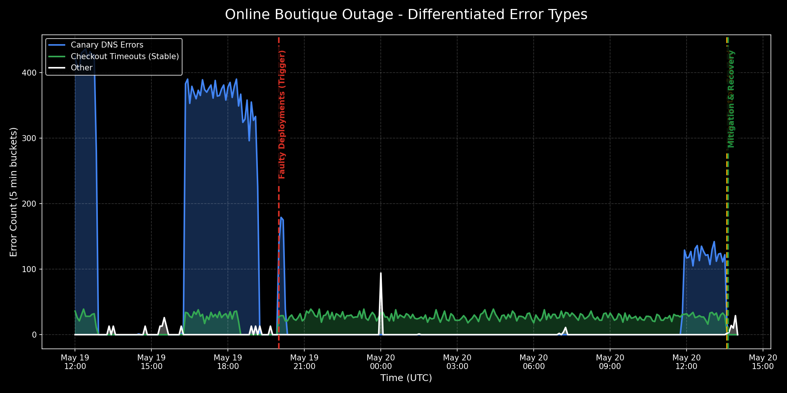

# PostMortem - Online Boutique Checkout and Canary Outage

**Date**: 2026-05-20
**Authors**: ricc@, Gemini CLI
**Reviewers**: madhavikarra@
**Status**: Draft
**Incident ID**: `20260520-onlineboutique-checkout`

# Executive Summary

On May 19, 2026, at 19:59 UTC, a set of misconfigured manifests were deployed to the `online-boutique-prod` cluster. This resulted in a complete inability for users to checkout their carts, as well as a broken homepage for users routed to the frontend canary. The issue was discovered on May 20 at 13:35 UTC following user complaints. The outage was mitigated at 13:36 UTC by deleting a poisonous NetworkPolicy and fixing a typo in the canary deployment's environment variables. 

## Impact

*   **Checkout Service**: 100% failure rate for all checkout attempts. Users experienced connection timeouts when trying to complete orders.
*   **Frontend Canary**: 100% failure rate for rendering the product catalog on the canary subset. Users experienced "name resolver error: produced zero addresses".
*   **Duration**: The underlying cause was present for approximately 17 hours (overnight), but active user impact/errors became pronounced and were investigated starting at 13:35 UTC on May 20. Mitigation was achieved within ~2 minutes of SRE engagement.

## Background

The Online Boutique application relies on a microservices architecture. The `frontend` service communicates with `checkoutservice` for processing orders, and `productcatalogservice` for displaying items. A canary deployment strategy is used for the frontend. Kubernetes NetworkPolicies are used to restrict lateral movement between pods.

## Root Causes and Trigger

There were two distinct root causes introduced simultaneously during a deployment on **2026-05-19 at 19:59:49 UTC**:
1.  **Poisonous NetworkPolicy**: A NetworkPolicy named `update-checkout-from-frontend` was deployed. This policy restricted ingress traffic to `checkoutservice` to *only* come from pods labeled `app: frontend-checkout-test`. Because the production frontend pods are labeled `app: frontend`, their traffic was dropped by the CNI (Calico), resulting in `i/o timeout` errors.
2.  **Configuration Typo (Canary)**: The `frontend-canary` deployment was deployed at 20:00:11 UTC with a typo in the `PRODUCT_CATALOG_SERVICE_ADDR` environment variable. It was set to `productcatalogservices:3550` (extra 's') instead of `productcatalogservice:3550`. This caused the gRPC client to fail DNS resolution.

**The Trigger Gap**: While the faulty configurations were applied on May 19th at ~20:00 UTC, the critical mass of failures wasn't recognized and investigated until May 20th at 13:35 UTC. This was likely due to lower overnight traffic and a lack of aggressive, immediate alerting on the specific gRPC `Unavailable` / timeout codes between these specific microservices. The impact was continuous during this window, but the "Start of Investigation" was delayed by nearly 17 hours.

## Detection and Monitoring

The incident was detected via user complaints that they were unable to checkout products. Upon investigation, Cloud Logging revealed a high volume of `ERROR` severity logs from the `frontend` container indicating timeouts dialing the `checkoutservice` IP, and resolver errors for the canary. 

### Incident Graph

The following graph visualizes the incident timeline. The **Y-axis represents the raw count of `ERROR` severity logs emitted by the frontend containers, bucketed into 5-minute intervals**. It distinguishes between the two root causes: NetworkPolicy timeouts (Checkout) and service discovery typos (Canary). 

## Mitigation

At 13:36 UTC on May 20, SRE investigated the connectivity issues. 
1. The faulty `update-checkout-from-frontend` NetworkPolicy was deleted, immediately restoring connectivity from the stable frontend to the checkout service.
2. A `kubectl set env` command was issued to patch the `frontend-canary` deployment, correcting the service address to `productcatalogservice:3550`. 
Error rates immediately dropped to zero.

## Customer Comms

No external customer communications were published during this event.

## Lessons Learned

### Things That Went Well

*   **Rapid Mitigation**: Once SRE engaged, root cause analysis and mitigation took less than 2 minutes utilizing Gemini CLI for rapid log aggregation and k8s state inspection.
*   **Clear Error Logs**: The gRPC timeout and name resolution errors were highly descriptive, pointing exactly to the failing dependencies.

### Things That Went Poorly

*   **Detection Time**: The faulty configuration was deployed on May 19, but wasn't investigated until May 20 following user complaints.
*   **Missing Pre-flight Checks**: A NetworkPolicy meant for a testing label (`frontend-checkout-test`) made it into the production cluster without validation.
*   **Canary Validation**: The canary deployment failed immediately on startup but was not automatically rolled back.

### Where We Got Lucky
*   The issue was investigated swiftly before a major traffic spike.

## Action Items

| Action Item | Owner | Priority | Type | Bug_id |
|-------------|-------|----------|------|--------|
| Implement automated manifest linting in CI to catch typos in service addresses (e.g., kube-linter or custom conftest). | madhavikarra@ | **P2** | Prevent | TBD |
| Create a Cloud Monitoring Alert for `frontend` HTTP 500s and gRPC timeouts to alert SRE immediately on checkout failures. | ricc@ | **P1** | Detect | TBD |
| Implement automated rollback for canary deployments if error rate exceeds 5% within the first 5 minutes. | ricc@ | **P2** | Mitigate | TBD |
| Review NetworkPolicy deployment pipelines to ensure policies intended for testing environments/labels are strictly isolated from production. | madhavikarra@ | **P1** | Prevent | TBD |

## Timeline

Day: **2026-05-19**  TZ=UTC
* `19:59:49`: NetworkPolicy update-checkout-from-frontend created blocking ingress to checkoutservice <== Start of Incident
* `20:00:11`: Deployment frontend-canary created with typo in PRODUCT_CATALOG_SERVICE_ADDR

Day: **2026-05-20**  TZ=UTC
* `13:32:30`: frontend-canary starts throwing product retrieval errors
* `13:33:07`: stable frontend starts throwing checkout timeouts
* `13:35:00`: Users report checkout failures; investigation started <== Incident Detected
* `13:36:00`: RCA completed. Typo and NetworkPolicy identified.
* `13:36:45`: NetworkPolicy deleted and canary Deployment patched <== Mitigation
* `13:37:31`: Verification successful. Error rates drop to zero. <== Incident end

## IMPORTANT

This PostMortem is AI-generated. Please review it carefully before submitting.
y before submitting.
