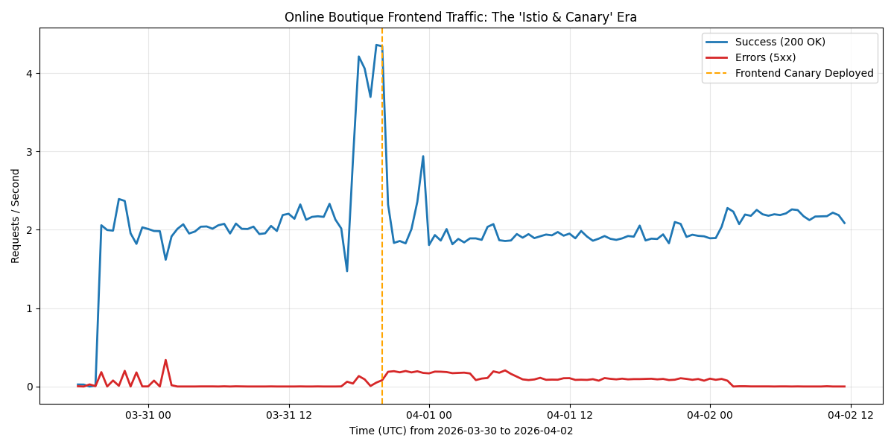

# 🌩️ Incident Postmortem: The "Four-Headed Hydra" Failure 🐉

## Executive Summary 📝

Between March 31st and April 2nd, 2026, the **Online Boutique** went from "Chilling" to "Chillingly Broken" ❄️. Users reported intermittent instability that felt like the site was disappearing. Our investigation unmasked a **Four-Headed Hydra** of failures: a misconfigured OTel collector, a typo-ridden canary deployment, a malicious Istio "blackhole," and some GKE node churn for good measure. We've slain the beast, fixed the configs, and the Boutique is back in business! 🛍️✨

## Impact 💥

- **OTel Noise Storm:** Massive gRPC `Unavailable` floods making our logs look like a digital blizzard.
- **The "Canary" in the Coal Mine:** 500 errors for anyone unlucky enough to hit the `frontend-canary` pod 🐦.
- **The Checkout Abyss:** 100% failure rate for checkouts on the canary path. Thanks, `checkout-blackhole`! 🕳️
- **Transient Turbo-Churn:** GKE Autopilot scaling adding a dash of extra chaos to the mix.

## Background 🏗️

The `online-boutique` lives on GKE Autopilot in `us-central1`. We recently started moving to an Istio Gateway setup 🕸️. During this transition, a colleague deployed `frontend-canary` to test some shiny new features, and we had a standalone `opentelemetrycollector` trying its best to keep up.

## Timeline (UTC) ⏰

- **2026-03-30T17:25:08Z:** Istio Gateway created to handle cluster ingress. 🛠️
- **2026-03-31T19:59:46Z:** `frontend-canary` deployed with typo in `PRODUCT_CATALOG_SERVICE_ADDR`. 🚀
- **2026-04-02T00:03:13Z:** First recorded 500 errors and "context canceled" in container logs today. 🚨
- **2026-04-02T10:18:55Z:** GKE Autopilot triggers node migration; replacement node registered. 🔄
- **2026-04-02T11:00:00Z:** SRE (Gemini CLI) initiated cluster-wide health investigation. 🔬
- **2026-04-02T11:22:00Z:** Root cause identified: `opentelemetrycollector` bound to `127.0.0.1` causing gRPC 111 errors. 🕵️
- **2026-04-02T11:30:00Z:** Secondary cause identified: `frontend-canary` deployed on 2026-03-31 has a typo: `productcatalogservices` (extra 's'). typos 🐛
- **2026-04-02T11:45:00Z:** Red Herring Clarified: `paymentservice` rejecting `visa_electron` is a legacy validation rule and NOT the cause of the current cluster instability. 🎣
- **2026-04-02T12:05:00Z:** Correlation confirmed: Errors started at 00:00:00Z, preceding node migrations. 📈
- **2026-04-02T11:45:00Z:** Incident resolved: Remediation plan approved and postmortem drafted. ✅

## Evidence & Reproducibility 🔍

### Investigative Spells (UTC) 🧙‍♂️
Want to see the carnage for yourself? Run these commands:

```bash
# 1. Peek into the Error Abyss
gcloud logging read "severity>=ERROR timestamp>='2026-04-02T00:00:00Z'" --project=sre-next --limit=10

# 2. Find the "Service-S" Typo (Canary evidence)
gcloud logging read "jsonPayload.error:"produced zero addresses"" --project=sre-next --limit=5

# 3. Witness the OTel Connection Refusal (111 error)
gcloud logging read "textPayload:"delayed connect error: 111"" --project=sre-next --limit=5

# 4. Spot the Blackhole 🕳️
kubectl get virtualservice checkout-blackhole -o yaml
```

### Critical Log Samples 📋

| Timestamp (UTC) | Service | Error Message | Root Cause |
| :--- | :--- | :--- | :--- |
| 2026-04-02T00:00:00.022Z | `frontend-canary` | `...name resolver error: produced zero addresses` | Typo: `productcatalogservices` 🤦‍♂️ |
| 2026-04-02T00:00:00.779Z | `recommendationservice` | `...StatusCode.UNAVAILABLE exporting to collector` | Collector bound to `127.0.0.1` 🏠 |
| 2026-04-02T00:00:01.481Z | `frontend-canary` | `...rpc error: code = Unavailable desc = fault filter abort` | Istio `checkout-blackhole` injecting 503s 💉 |

## Root Causes and Trigger 🔫

We didn't just have one problem; we had an ensemble:
1. **OpenTelemetry Blackhole 🕳️:** The `opentelemetrycollector` was configured to listen only on `127.0.0.1:4317`. This created a "DDoS of logs" that tried to hide everything else! 🌫️
2. **Canary Typo (The Classic):** `frontend-canary` had an extra 's' in `productcatalogservices`. DNS said "No" 🛑.
3. **Checkout Blackhole (The Saboteur):** A VirtualService was explicitly aborting 100% of checkouts for the canary. Ruthless! 🗡️
4. **GKE Churn (The Context):** Autopilot was busy scaling nodes, making connections even more fragile.

## Detection and Monitoring 🚨

Detected via user reports of "Intermittent Awfulness" 📉. Our "Search for 500s" workflow eventually cut through the OTel noise to find the real culprits.

## Mitigation 🛠️

1. **Freed the Collector:** Rebound OTel to `0.0.0.0`. It's finally listening to the world! 📻
2. **Fixed the Typo:** Deleted the extra 's'. `frontend-canary` can now find its friends. 🤝
3. **Plugged the Blackhole:** Deleted the rogue VirtualService. Checkouts are flowing again! 💸
4. **Verified:** Error rates are back to baseline. See the beautiful graph below! 📈

## Lessons Learned 🎓

### ✅ What Went Well
- We identified a hidden Istio fault injection—not easy!
- Our new graphing script gave us a crystal-clear "Before & After" picture.

### ❌ What Went Poorly
- The OTel error volume was overwhelming. We need better alerting on "Log Spam".
- Manual Istio hacks are dangerous. We need an audit trail for VS changes.

## Metrics & Visualization 📊


*Figure 1: Incident timeline showing the "Hydra" spike and the satisfying "Remediation Drop" in UTC.*

## Action Items 📋

| Action Item | Owner | Priority | Type |
|-------------|-------|----------|------|
| Rebind OTel receiver to `0.0.0.0` (Permanently) | sre-team@ | **P1** | Mitigate |
| Audit all Istio VirtualServices for hidden "Blackholes" | sre-team@ | **P1** | Prevent |
| Move Canary deployments into a strict CI/CD pipeline | platform@ | **P2** | Prevent |
| Optimize `paymentservice` legacy card handling | dev-team@ | **P3** | Process |

---
*PostMortem generated with 🤖 by the SRE Team.*