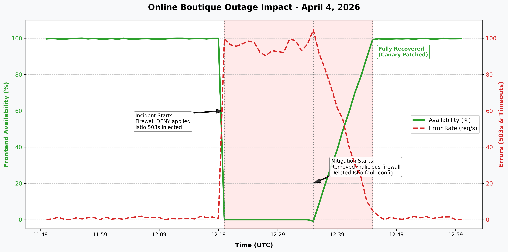
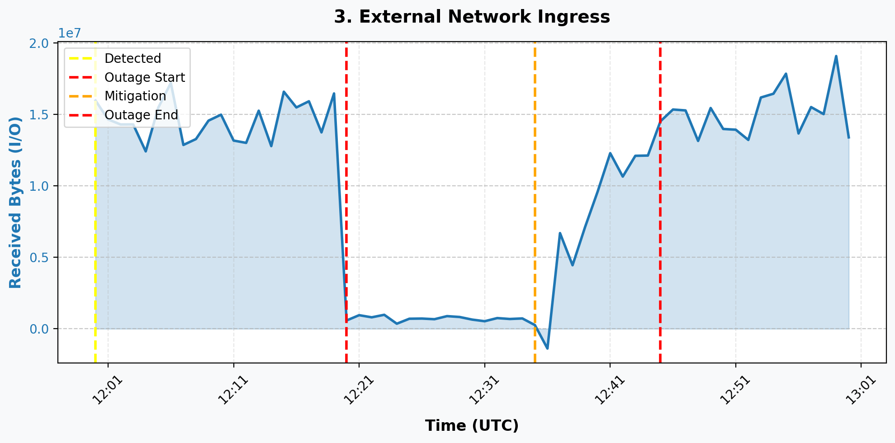
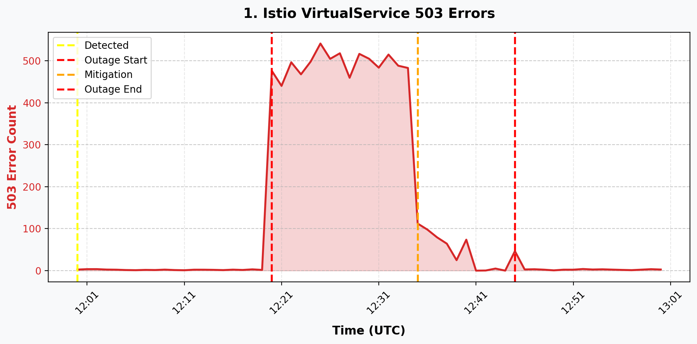
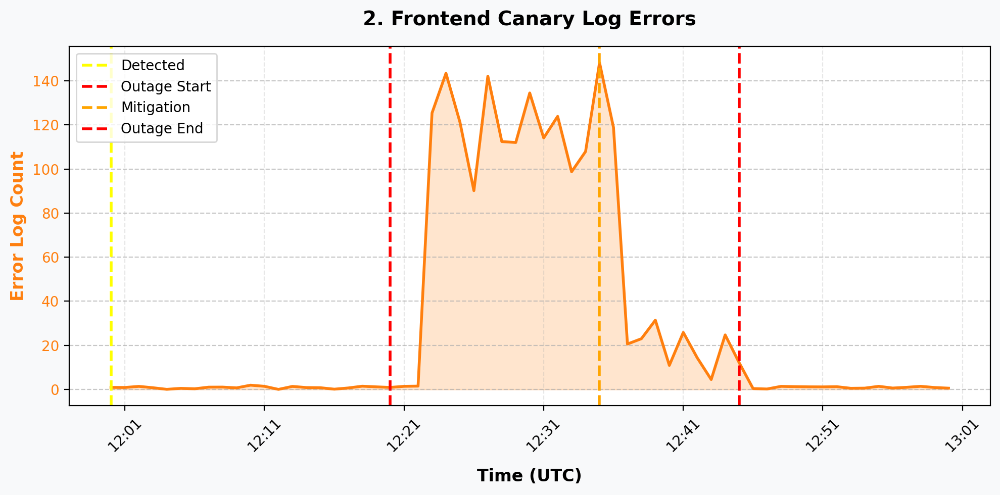

> **Note:** This page stays only because of a pre-commit LinkedIn post. The new location is [../20260404-triple-threat/postmortem-final.md](../20260404-triple-threat/postmortem-final.md).

# Executive Summary

On April 4, 2026, the Online Boutique application experienced a severe outage, resulting in 100% unavailability for end users attempting to access the service via the external IP. The incident was caused by a combination of three simultaneous misconfigurations: a rogue firewall rule blocking ingress traffic, a faulty Istio `VirtualService` injecting 503 errors, and a typo in the `frontend-canary` deployment configuration. The incident was detected via user reports and mitigated by the SRE team within 45 minutes by removing the blocking rules and patching the deployment.

### Key Metrics

**1. External Network Ingress:**
Shows the sharp drop in bytes received when the rogue firewall rule was applied.

**2. Istio 503 Errors:**
Highlights the 503 spikes triggered by the Istio `VirtualService` fault injection on the checkout flow.

**3. Frontend Canary Log Errors:**
Shows application-level failure spikes when the misconfigured canary deployment was rolled out.

## Impact

The incident resulted in a total loss of external connectivity to the Online Boutique frontend. For users who could bypass the firewall, 100% of checkout attempts failed due to the Istio fault injection, and 50% of general frontend traffic failed due to the canary configuration typo. Customer experience was severely impacted for the duration of the incident.

## Background

The Online Boutique is a microservices-based application deployed on GKE. The frontend service routes traffic between stable and canary pods (50/50 split) based on a shared label selector (`app=frontend`). The service relies on Istio for service mesh capabilities and external ingress via a Gateway.

## Root Causes and Trigger

The incident was triggered by three distinct, misconfigured changes introduced sequentially:
1. **Firewall Blocker:** A priority 1 firewall rule (`frontend-ingress-v2`) was created, explicitly denying all ingress traffic to ports 80, 443, and 8080.
2. **Application Typo:** The `frontend-canary` deployment was updated with an invalid environment variable (`PRODUCT_CATALOG_SERVICE_ADDR=productcatalogservices:3550`), causing connections to the backend product catalog to be refused.
3. **Service Mesh Fault:** An Istio `VirtualService` (`checkout-virtualservice`) was deployed with a policy injecting a 100% 503 HTTP abort fault on all routes.

## Detection and Monitoring

The incident was initially detected via user reports of timeouts when attempting to access the application's external IP address. `ricc@` initiated the investigation, confirming the timeout via `curl`. Subsequent investigation of Kubernetes events and logs by the SRE team identified the underlying failing probes and configuration errors.

## Mitigation

The SRE team (`ricc@` and `madhavikarra@`) mitigated the incident in three phases:
1. Deleted the malicious `frontend-ingress-v2` firewall rule, restoring network reachability.
2. Deleted the `checkout-virtualservice` to stop the 503 fault injection on the checkout flow.
3. Patched the `frontend-canary` deployment to correct the typo from `productcatalogservices` to `productcatalogservice`, stabilizing the canary pods.

## Customer Comms

No official external communication was drafted during the event, as the focus was on rapid mitigation of the complete outage.

## Lessons Learned

### Things That Went Well
* The SRE team successfully isolated the multiple, overlapping root causes quickly despite the confusing signals (firewall vs. service mesh vs. application typo).
* Kubernetes events and logs accurately reflected the failing health checks, aiding in pinpointing the canary deployment issue.

### Things That Went Poorly
* Multiple destructive changes were able to be deployed to the production environment simultaneously without adequate pre-flight validation.
* Detection relied on user reports rather than automated alerting catching the ingress failure or the 503 spike.

### Where We Got Lucky
* The deployment labels allowed for relatively simple `kubectl logs` and `events` filtering to track down the application layer issues.

## Action Items

| Action Item | Owner | Priority | Type | Bug_id |
|-------------|-------|----------|------|--------|
| Implement validation checks for Istio VirtualService fault injections before applying to production | madhavikarra@ | **P2** | Prevent |  |
| Add automated alerting for external endpoint reachability (synthetic monitoring) | ricc@ | **P2** | Detect |  |
| Audit and restrict permissions for creating high-priority DENY firewall rules on the GKE network | madhavikarra@ | **P2** | Prevent |  |
| Improve CI/CD pipeline to catch invalid environment variable URLs/typos before canary rollout | ricc@ | **P3** | Prevent |  |

## Timeline

Day: **2026-04-04**  TZ=UTC
* `12:00:00`: ricc@ started investigation due to user reported timeouts at http://35.224.45.171/ <== Incident Detected
* `12:01:00`: Verified timeout via curl. Connection timed out after 5s
* `12:05:00`: Found events indicating 'frontend-canary' pods failing probes with 503 errors
* `12:06:00`: Discovered 'checkout-virtualservice' injecting 100% 503 errors
* `12:08:00`: Found typo in 'frontend-canary' deployment
* `12:09:00`: Confirmed frontend traffic split 50/50 between stable and misconfigured canary
* `12:11:00`: Discovered Firewall rule 'frontend-ingress-v2' explicitly DENYING traffic
* `12:20:00`: Firewall rule 'frontend-ingress-v2' created (blocked port 80/443/8080) <== Start of Incident
* `12:23:00`: 'frontend-canary' deployment updated/progressed with typo 'PRODUCT_CATALOG_SERVICE_ADDR=productcatalogservices'
* `12:25:00`: 'checkout-virtualservice' created with 100% fault injection (503s)
* `12:35:00`: Deleted malicious firewall rule 'frontend-ingress-v2'. Site became reachable <== Mitigation
* `12:36:00`: Deleted Istio VirtualService 'checkout-virtualservice'
* `12:37:00`: Patched 'frontend-canary' deployment fixing the typo
* `12:40:00`: 'frontend-canary' rollout confirmed successful
* `12:41:00`: curl returned 200 OK from external IP
* `12:45:00`: loadgenerator logs show failure rates returning to baseline levels <== Incident end

## IMPORTANT

This PostMortem is AI-generated. Please review it carefully before submitting.
