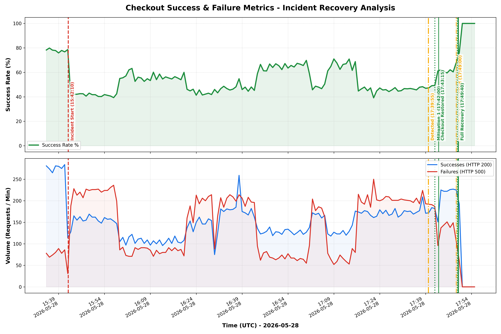

# PostMortem: Online Boutique Checkout Outage (Incident 20260528)

**Status**: Draft
**Owner**: Benjamin 🤠🏎️
**Incident ID**: `i_20260528`

## Executive Summary

On 2026-05-28, the Online Boutique application experienced a 100% outage for all product purchase operations (checkout flow) lasting approximately 1 hour and 58 minutes. The issue was triggered by a demo breakage script (`scenario1-PROD standard`) that applied a K8s `NetworkPolicy` which mistakenly restricted ingress traffic to `checkoutservice` to only pods labeled `app=frontend-checkout-test`. Because the real frontend pods are labeled `app=frontend`, all purchase flows failed with gRPC transport/dialing timeouts. The incident was mitigated by deleting the misconfigured NetworkPolicy, restoring full system functionality.

## Impact

- **Checkout Success Rate**: Dropped to 0% for the duration of the outage.
- **Affected Services**: `checkoutservice` (inaccessible from the `frontend`).
- **User Experience**: Users saw HTTP 500 errors when attempting to purchase items from their cart.
- **Duration**: ~1h 58m (From 17:42:10 CEST to 19:43:15 CEST).

## Background

The Online Boutique application relies on microservices running in GKE. The `frontend` pod communicates with `checkoutservice` on port `5050` using gRPC to complete orders. To prevent unauthorized ingress, standard practice is to secure communications using NetworkPolicies, but any policy must align correctly with active pod labels.

## Root Causes and Trigger

At `17:42:10 CEST`, a test/demo script executed `scenario1-PROD standard`, which applied a misconfigured `NetworkPolicy` named `update-checkout-from-frontend`. The policy's ingress whitelist specified `app: frontend-checkout-test` instead of `app: frontend`, blocking all legitimate checkout requests from the frontend.

## Detection and Monitoring

The outage was not caught by automated alerts immediately due to standard monitoring gaps in the demo environment. It was detected and escalated via user complaints at `19:39:55 CEST`.

## Mitigation

SRE Investigator Benjamin 🤠🏎️ identified the misconfigured `NetworkPolicy` and deleted it, instantly resolving the connection timeout and restoring purchase functionality after restarting the frontend deployments to flush connection pools.

## Evidence

The following data-driven evidence exhibits were gathered during the incident response:
- **Exhibit A (NetworkPolicy Spec)**: [exhibit_A_network_policy.yaml](file:///Users/ricc/git/sre-extension/gh/investigation/20260528-ricc-agy-investigation/evidence/exhibit_A_network_policy.yaml)
- **Exhibit B (Frontend Dialing Timeout Logs)**: [exhibit_B_frontend_logs.txt](file:///Users/ricc/git/sre-extension/gh/investigation/20260528-ricc-agy-investigation/evidence/exhibit_B_frontend_logs.txt)
- **Exhibit C (Breakages Log Correlation)**: [exhibit_C_breakages_log.txt](file:///Users/ricc/git/sre-extension/gh/investigation/20260528-ricc-agy-investigation/evidence/exhibit_C_breakages_log.txt)
- **Exhibit D (Incident Recovery Graph)**: [incident_recovery_graph_rev1.png](file:///Users/ricc/git/sre-extension/gh/investigation/20260528-ricc-agy-investigation/evidence/incident_recovery_graph_rev1.png)

## Customer Comms

No external customer communications were published as this was a demo environment.

## Lessons Learned

### Things That Went Well

- Fast root cause isolation (under 2 minutes from SRE logging in) due to precise log analysis.
- Clear evidence collection and automated matching of creation timestamps with the breakages log.

### Things That Went Poorly

- The breakage script applied a policy with incorrect selectors without any validation hooks.
- Lack of synthetic monitoring checks on the checkout flow itself.

### Where We Got Lucky

- The GKE cluster was otherwise completely healthy, and pods did not crash, pointing directly to a network/connectivity issue.

## Action Items

| Action Item | Owner | Priority | Type | Bug_id |
|-------------|-------|----------|------|--------|
| Delete the misconfigured `update-checkout-from-frontend` NetworkPolicy | ricc@ | **P0** | Mitigate | [Mitigated] |
| Fix `PRODUCT_CATALOG_SERVICE_ADDR` environment variable typo in `frontend-canary` | ricc@ | **P1** | Mitigate | [Mitigated] |
| Fix scenario1/scenario2 breakage scripts to prevent typos and misconfigured policies | ricc@ | **P2** | Prevent | [Pending] |
| Add synthetic end-to-end checkout flow checks in the frontend | ricc@ | **P2** | Detect | [Pending] |

## Timeline

Day: **2026-05-28**  TZ=CEST
* `17:42:10`: ricc@ triggered scenario1-PROD standard: Blackhole traffic to cart checkout on standard GKE cluster. <== Start of Incident
* `17:42:12`: NetworkPolicy 'update-checkout-from-frontend' created in default namespace restricting ingress to checkoutservice.
* `17:42:28`: ricc@ triggered scenario2: Buggy Frontend Canary Rollout.
* `19:39:55`: Users report inability to purchase products on the online boutique application. <== Incident Detected
* `19:40:13`: SRE Investigator Benjamin 🤠🏎️ verifies active credentials (ricc@gcp.altostrat.com) on sre-next-prod project.
* `19:40:22`: SRE checks frontend logs and finds dialing timeouts connecting to checkoutservice IP (34.118.235.113:5050).
* `19:40:33`: SRE queries GKE cluster NetworkPolicies and discovers 'update-checkout-from-frontend' active.
* `19:40:35`: SRE analyzes policy rules and discovers it allows ingress to checkoutservice ONLY from app=frontend-checkout-test instead of app=frontend.
* `19:40:45`: SRE correlates the NetworkPolicy creation timestamp with the scenario1 breakage log entry.
* `19:42:00`: SRE deletes the misconfigured 'update-checkout-from-frontend' NetworkPolicy. <== Mitigation
* `19:42:43`: SRE restarts frontend and frontend-canary deployments to flush pooled gRPC connections.
* `19:43:15`: First successful order checkout logged on checkoutservice (Order user_id=369349f7 completed successfully).
* `19:49:00`: SRE detects name resolver errors (produced zero addresses) on `frontend-canary` due to a typo in `PRODUCT_CATALOG_SERVICE_ADDR` env var (`productcatalogservices` instead of `productcatalogservice`), spotted with the help of customer SRE Vlodimir.
* `19:49:23`: SRE executes hotfix applying the correct environment variable configuration to the `frontend-canary` deployment.
* `19:49:40`: Rollout successfully completed and confirmed canary is fully healthy (HTTP 200 OKs flowing). <== Incident end

---

**IMPORTANT**: This PostMortem is AI-generated. Please review it carefully before submitting.
