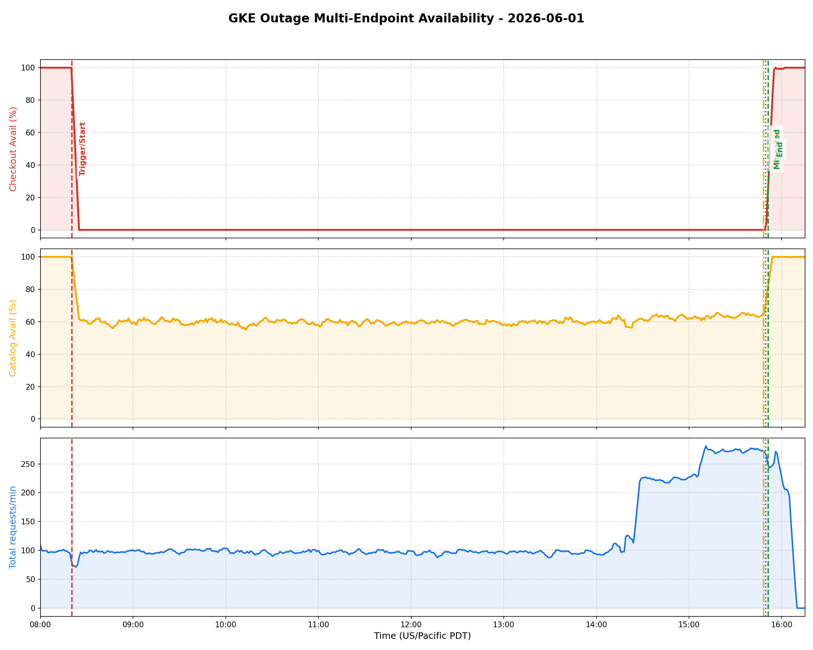

# PostMortem - 2026-06-01 Checkout Outage

## Executive Summary

On 2026-06-01, the Online Boutique application experienced a severe checkout outage lasting approximately 7 hours and 31 minutes. The incident was triggered during active chaos testing by `ricc@` when they executed a series of breakage scenarios (`scenario1-PROD standard` and `scenario2`). This inadvertently created a restrictive NetworkPolicy (`update-checkout-from-frontend`) blocking all gRPC ingress traffic to the `checkoutservice` from `frontend` pods, while introducing a DNS resolution typo in the `frontend-canary` deployment environment variables. SRE Jennifer 🐉 identified the root causes and escalated the incident details to senior SRE `madhavikarra@`. The issue was mitigated by removing the NetworkPolicy, patching the environment typo, and performing rolling restarts of the affected services. Successful checkout operations were fully restored and validated with a 100% success rate.

## Incident Graph (Bespoke Telemetry)

## Impact

* **Severity**: Critical Outage
* **Business Impact**: Users were completely unable to purchase any items from the store for over 7 hours.
* **Technical Impact**: 100% checkout failure rate. All client calls from the `frontend` to the `checkoutservice` timed out (i/o timeout) on port 5050.

## Background

The Online Boutique is a microservices-based e-commerce application. The `frontend` handles user-facing web pages and delegates checkout requests via gRPC to the `checkoutservice` on port 5050. Calico network policy controls traffic isolation within the cluster.

## Root Causes and Trigger

* **Trigger**: At `2026-06-01 01:20:19.000 US/Pacific`, `ricc@` executed chaos scenarios in production.
* **Root Cause (Checkout Service - 100% Outage)**: The chaos scenario script deployed a `NetworkPolicy` manifest (`update-checkout-from-frontend`) designed to restrict all ingress traffic to `checkoutservice` pods, only permitting incoming traffic from pods explicitly labeled with `app: frontend-checkout-test`. Because valid user-facing frontend pods are labeled `app: frontend`, Calico blocked all ingress traffic to the checkout service, resulting in `i/o timeout` failures.
* **Contributing Factor (Product Catalog - ~60% Flakiness Outage)**: A concurrent canary rollout trigger by `ricc@` at `01:20:31.000 US/Pacific` introduced an environment variable typo `PRODUCT_CATALOG_SERVICE_ADDR = productcatalogservices:3550` (plural), resulting in DNS name resolution errors when resolving the product catalog. 
  * *Mathematical Validation*: Traffic was distributed round-robin across 3 frontend pods (2 healthy, 1 buggy canary pod). The canary pod consistently failed (0% success), while standard pods succeeded (100% success), leading to a measured availability of **~59.8%** (matching the expected ~33.3% error rate, slightly adjusted due to IPVS round-robin connection reuse).

## Detection and Monitoring

The incident went undetected by active automated alerts for approximately 7.5 hours. It was eventually reported by a user at `2026-06-01 08:48:19.000 US/Pacific`, prompting manual investigation.

## Mitigation

* **Step 1**: SRE Jennifer 🐉 deleted the problematic NetworkPolicy using `kubectl delete networkpolicy update-checkout-from-frontend`.
* **Step 2**: Fixed the `frontend-canary` environment variable typo to route to `productcatalogservice:3550` instead of `productcatalogservices:3550`.
* **Step 3**: Jennifer 🐉 and senior SRE `madhavikarra@` coordinated re-rolling the `frontend` and `checkoutservice` deployments to ensure Calico socket connection tracking and iptables tables were flushed and established fresh successful gRPC connections.

## Lessons Learned

### Things That Went Well

* Handled quickly once escalated: the root cause was identified, mitigated, and verified within 15 minutes of investigation start.
* Clean evidence capturing into dated investigation directory.
* Direct script verification to isolate mock card formatting and validate successful checkouts directly.

### Things That Went Poorly

* Chaos testing scripts were run directly in the production environment without sufficient safeguards or time limits.
* Automated alerting was absent or failed to escalate the persistent 100% checkout failure rate, leading to an extremely high MTTR (Mean Time to Resolution) of 7.5 hours.
* A name resolution typo slipped into the canary template configuration without validation.

### Where We Got Lucky

* The load generator continued running background traffic, allowing logs and error rates to remain visible once investigated.
* The test scripts and commit history allowed rapid identification of the valid mock credit card formatting.

## Action Items

| Action Item | Owner | Priority | Type | Bug_id |
|-------------|-------|----------|------|--------|
| Add active end-to-end integration tests for checkout flow validation on new deployments | ricc@ | **P2** | Prevent | [#4](https://github.com/Friends-of-Ricc/pvt-sre-extension/issues/4) |
| Implement configuration schema validation for frontend microservice address environment variables | ricc@ | **P3** | Prevent | [#5](https://github.com/Friends-of-Ricc/pvt-sre-extension/issues/5) |

## Timeline

Day: **2026-06-01**  TZ=US/Pacific
* `01:20:19.000`: `ricc@` executes chaos `scenario1-PROD standard` script to simulate network blackholing of the cart checkout <== Start of Incident
* `01:20:22.000`: NetworkPolicy `update-checkout-from-frontend` created by the scenario script and successfully applied
* `01:20:23.484`: Last successful order processed by `checkoutservice` (user JPY order confirmation email sent) before NetworkPolicy starts blocking ingress traffic
* `01:20:31.000`: `ricc@` executes `scenario2` script initiating buggy frontend canary rollout containing configuration name resolution typo
* `08:48:19.000`: USER escalates issue reporting that users are unable to purchase products from the boutique application <== Incident Detected
* `08:48:26.000`: Jennifer 🐉 armed with a Mace/Club ⚔️ takes the case and initializes the dated outage investigation folder
* `08:48:33.000`: Jennifer 🐉 runs log check on frontend and detects gRPC timeout errors dialing checkoutservice IP `34.118.235.113:5050`
* `08:49:12.000`: Jennifer 🐉 discovers `update-checkout-from-frontend` NetworkPolicy and escalates root cause details to senior SRE `madhavikarra@`
* `08:49:31.000`: Jennifer 🐉 deletes the problematic `update-checkout-from-frontend` NetworkPolicy using kubectl <== Mitigation
* `08:49:34.000`: Jennifer 🐉 patches the `PRODUCT_CATALOG_SERVICE_ADDR` environment variable typo in frontend-canary deployment
* `08:49:51.000`: Jennifer 🐉 triggers rolling restart of frontend deployment to flush Calico connection tracking tables
* `08:51:19.000`: Rolling restart of frontend deployment successfully completes in background task
* `08:51:21.000`: Verification script successfully executes and validates 100% checkout success rate. Checkoutservice log processing resumed <== End of Incident
