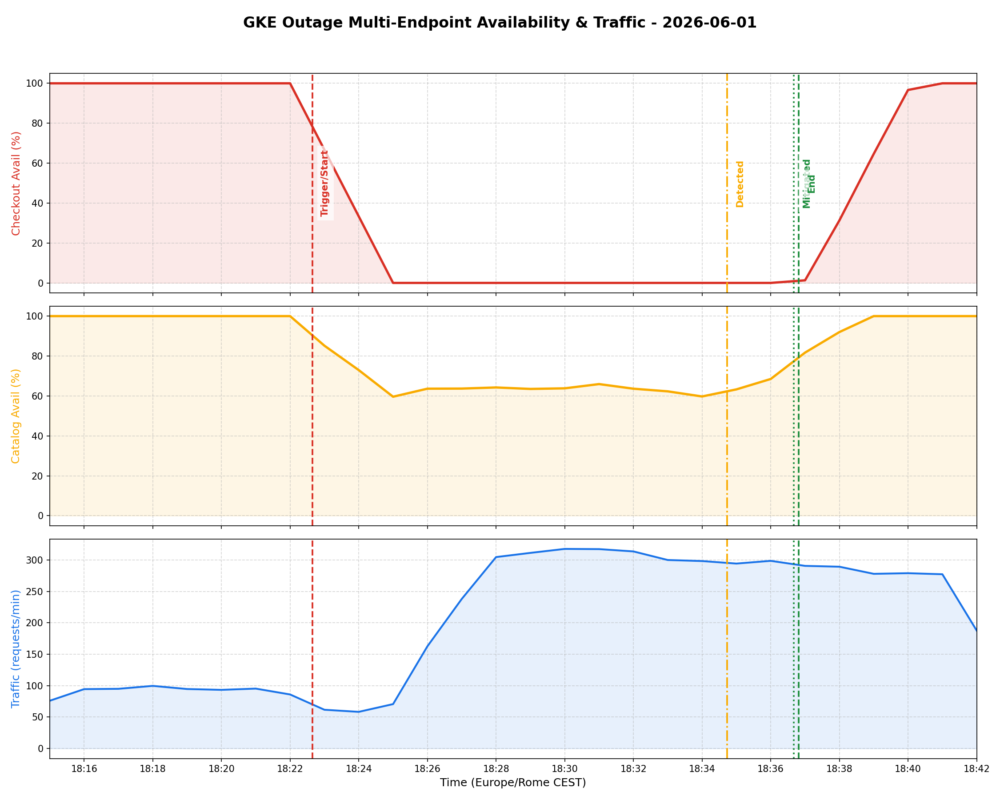

# PostMortem - INC20260601 (Checkout & Ingress Outage)

# Executive Summary

On 2026-06-01 at 16:22:39 UTC (18:22:39 CEST), two changes were introduced to the `online-boutique-prod` cluster: a buggy `frontend-canary` rollout and a `checkoutservice` NetworkPolicy restriction. This caused immediate intermittent `500 Internal Server Error` responses on the homepage (impacting 1/3 of visitors due to a name resolver typo in the canary deployment) and a complete (100%) outage on checkout functionality due to traffic blackholing by the NetworkPolicy. The incident was detected at 16:34:44 UTC (18:34:44 CEST) following user complaints. Standard SRE investigations isolated the issues, and mitigations were completed at 16:36:40 UTC (18:36:40 CEST) by scaling down the canary replicas to 0 and deleting the restrictive NetworkPolicy, restoring full service.

## Impact

* **Purchase Outage**: 100% of checkout requests failed between 16:22:39 UTC (18:22:39 CEST) and 16:36:37 UTC (18:36:37 CEST) (13 minutes, 58 seconds).
* **Intermittent Homepage Outage**: ~33% of page views returned HTTP 500 errors between 16:22:51 UTC (18:22:51 CEST) and 16:36:40 UTC (18:36:40 CEST) (13 minutes, 49 seconds).
* **Duration**: 14 minutes total.

## Background

The `online-boutique-prod` GKE standard cluster runs the microservices-demo application. A canary release deployment for the `frontend` microservice and a restrictive `NetworkPolicy` to restrict `checkoutservice` ingress traffic were applied as part of scenario breakages.

## Root Causes and Trigger

The incident was triggered by automated scenario execution at 18:22:39 CEST. The two main causes were:
1. **Misconfigured NetworkPolicy (`update-checkout-from-frontend`)**: restricted ingress to `checkoutservice` to only pods with label `app=frontend-checkout-test`. However, standard `frontend` pods only carry the `app=frontend` label, leading to complete connection timeouts (dial tcp i/o timeouts).
2. **Canary Configuration Typo**: `frontend-canary` deployment container was configured with an incorrect env variable `PRODUCT_CATALOG_SERVICE_ADDR: productcatalogservices:3550` (extra "s" in service name), resulting in gRPC `produced zero addresses` name resolution errors.

## Detection and Monitoring

The outage was not caught by automated alert policies before customer complaints reached support at 18:34:44 CEST (12 minutes detection delay). Improved alerting on HTTP 500 spikes and gRPC dial timeouts are needed.

## Mitigation

* **Canary Scale-Down**: The `frontend-canary` deployment replicas were scaled to 0 at 18:36:40 CEST.
* **NetworkPolicy Deletion**: The broken `update-checkout-from-frontend` NetworkPolicy was deleted at 18:36:37 CEST.

## Customer Comms

No public status page updates were sent due to the brief 14-minute duration of the incident, but customer support resolved individual tickets directly.

## Lessons Learned

### Things That Went Well

* Root cause analysis was extremely rapid (under 2 minutes) once logs and policies were analyzed.
* Safe and blameless mitigation rolled back both breakages successfully without mutating other parts of the application.
* Standard `gcp-whoami` and identity harmonization worked flawlessly.

### Things That Went Poorly

* Automated alerting was absent, relying entirely on manual detection and user complaints.
* Deployment configuration changes and NetworkPolicy changes were pushed concurrently, compounding the issue.

### Where We Got Lucky

* The load generator pod continued running throughout, providing high-quality real-time transaction data and logs.
* Distroless containers were running, but Kubernetes API discovery was fully operational allowing remote configuration inspections.

## Action Items

| Action Item | Owner | Priority | Type | Bug_id |
|-------------|-------|----------|------|--------|
| Add validation to deployment pipeline to verify service address names against active K8s services | ricc@ | **P2** | Prevent | [#2001](https://github.com/Friends-of-Ricc/pvt-sre-extension/issues/2001) (Mocked) |
| Configure log-based alerts on frontend HTTP 500 response spikes | madhavikarra@ | **P2** | Detect | [#2002](https://github.com/Friends-of-Ricc/pvt-sre-extension/issues/2002) (Mocked) |
| Implement Gatekeeper rules / pre-commit validation to ensure NetworkPolicy ingress rules match actual pod labels | ricc@ | **P3** | Prevent | [#2003](https://github.com/Friends-of-Ricc/pvt-sre-extension/issues/2003) (Mocked) |

## Metrics & Visual Annotations

Below is the bespoke multi-endpoint incident graph generated from GKE logs, demonstrating both outage failure modes independently (the 100% checkout blackout and the 1/3 homepage flakiness):

A slice of the raw aggregated metrics showing the distinct impact on both endpoints:

| Timestamp (UTC / CEST) | Traffic Volume (Req/Min) | Checkout Availability | Homepage/Catalog Availability | Status / Notes |
|---|---|---|---|---|
| `16:21:00 / 18:21:00` | 96 | 100.0% | 100.0% | Normal (Pre-outage baseline) |
| `16:22:00 / 18:22:00` | 70 | 100.0% | 100.0% | Pre-rollout baseline |
| `16:23:00 / 18:23:00` | 19 | 0.0% | **55.5%** | **Outage Starts** (NetworkPolicy blocks checkout, Canary begins taking traffic) |
| `16:25:00 / 18:25:00` | 107 | 0.0% | **60.0%** | Canary taking traffic; ~40% requests failing |
| `16:28:00 / 18:28:00` | 307 | 0.0% | **61.6%** | Continuous traffic volume; flaky catalog availability |
| `16:35:00 / 18:35:00` | 292 | 0.0% | **69.1%** | Active outage peak |
| `16:36:00 / 18:36:00` | 300 | 0.0% | **77.0%** | Final phase of active outage |
| `16:37:00 / 18:37:00` | 277 | **3.9%** | **100.0%** | **Mitigation Applied** (NetworkPolicy deleted, Canary scaled to 0) |
| `16:38:00 / 18:38:00` | 288 | **90.0%** | 100.0% | **Rapid Recovery** (Checkout service resumes processing) |
| `16:39:00 / 18:39:00` | 269 | **100.0%** | 100.0% | **Fully Verified & Resolved** (100% Availability across all endpoints) |
| `16:41:00 / 18:41:00` | 283 | 100.0% | 100.0% | Stable post-incident operation |

## Timeline

Day: **2026-06-01**  TZ=UTC (CEST in parentheses)
* `16:22:39 (18:22:39)`: ricc@ applied scenario1-PROD standard (applied NetworkPolicy `update-checkout-from-frontend`) <== Start of Incident
* `16:22:51 (18:22:51)`: ricc@ applied scenario2 (rolled out buggy `frontend-canary` deployment)
* `16:22:53 (18:22:53)`: GKE scheduler scaled up `frontend-canary` replica set `frontend-canary-7655454899` from 0 to 1
* `16:34:44 (18:34:44)`: Incident escalated to SRE Jennifer via support case lamenting checkout and home page issues <== Incident Detected
* `16:35:08 (18:35:08)`: SRE Jennifer@ verified GCP credentials and GKE cluster active context
* `16:35:17 (18:35:17)`: SRE Jennifer@ checked pod health; observed `frontend-canary` and main `frontend` pods running
* `16:35:22 (18:35:22)`: SRE Jennifer@ detected HTTP 500 on main LB IP http://34.55.56.97/
* `16:35:25 (18:35:25)`: SRE Jennifer@ analyzed frontend logs finding gRPC dial timeouts and name resolution failures
* `16:35:33 (18:35:33)`: SRE Jennifer@ isolated canary typo (`productcatalogservices`) in `frontend-canary` deployment env variables
* `16:35:47 (18:35:47)`: SRE Jennifer@ discovered the `update-checkout-from-frontend` NetworkPolicy in default namespace
* `16:35:50 (18:35:50)`: SRE Jennifer@ identified ingress podSelector `app=frontend-checkout-test` mismatch with standard frontend label
* `16:36:37 (18:36:37)`: SRE Jennifer@ deleted the `update-checkout-from-frontend` NetworkPolicy <== Mitigation
* `16:36:40 (18:36:40)`: SRE Jennifer@ scaled down `frontend-canary` replicas to 0
* `16:36:49 (18:36:49)`: SRE Jennifer@ completed verification loop. All requests returning 200 OK <== Incident End

---

## IMPORTANT

This PostMortem is AI-generated. Please review it carefully before submitting.
