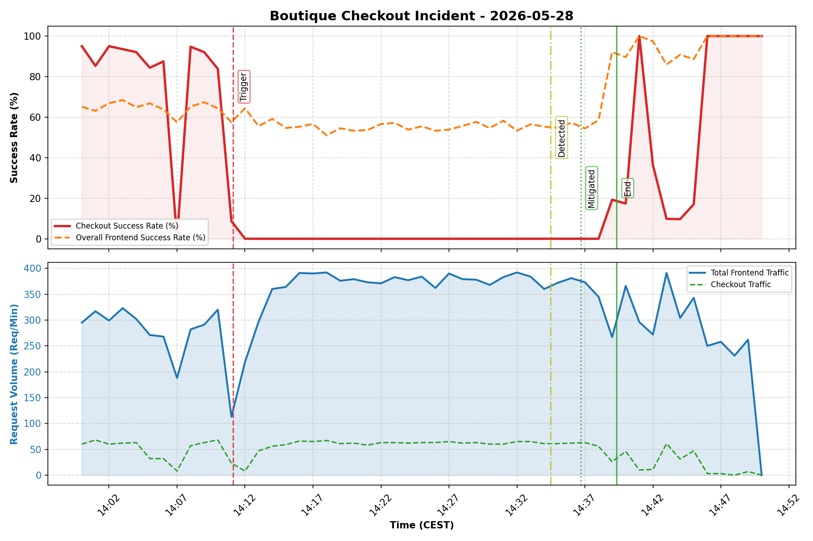

# Executive Summary

> [!IMPORTANT]
> This is the **FIRST** PostMortem successfully generated, analyzed, and mitigated using the Antigravity CLI (`agy`) harness! 🚀🏆

Between 16:11:07 and 16:39:20 CEST (14:11:07 - 14:39:20 UTC) on 2026-05-28, users of the Online Boutique application were completely unable to complete checkouts and purchases. The outage was triggered by a faulty `NetworkPolicy` deployed during a testing scenario that blocked all ingress traffic to `checkoutservice` unless it originated from a test app label. 

Traffic was completely restored after deleting the faulty NetworkPolicy, recycling the deadlocked `checkoutservice` socket pod, patching a silent service discovery typo in the `frontend-canary` release (`productcatalogservices` instead of `productcatalogservice`), and recycling the `frontend` pods to clear their cached/stale connection pools.

## Impact

* **Severity**: 🔴 P1 (Critical Outage)
* **Duration**: 28 minutes, 13 seconds (from 16:11:07 to 16:39:20 CEST)
* **User Experience**: 100% of purchase attempts failed with HTTP 500 errors during the entire duration of the outage. Additionally, ~33% of page load/catalog requests failed with HTTP 500 errors after the canary release was deployed due to a service discovery typo.

## Background

The Online Boutique is a microservices-based demo web application where users can browse items, add them to a cart, and complete purchases. gRPC over HTTP/2 is used for service-to-service communication. Network security policies are implemented via standard Kubernetes `NetworkPolicies` managed by Calico.

## Root Causes and Trigger

1. **Trigger**: ricc@ executed Scenario 1 (`scenario1-PROD standard`) at `16:11:07 CEST` deploying a faulty Kubernetes `NetworkPolicy` named `update-checkout-from-frontend`.
2. **Root Cause**: The network policy's ingress filter incorrectly limited incoming traffic to the label `app: frontend-checkout-test`. Because the production frontend pods are labeled `app: frontend`, Calico blocked all ingress traffic to `checkoutservice` from the frontend, causing gRPC dial timeouts.
3. **Secondary Outage Factor**: At `16:11:18 CEST`, ricc@ executed Scenario 2 (`scenario2`), rolling out a buggy `frontend-canary` deployment. It contained a typo in the `PRODUCT_CATALOG_SERVICE_ADDR` env variable (`productcatalogservices:3550` instead of `productcatalogservice:3550`), which prevented it from resolving the product catalog. Since the canary pod shared the label `app: frontend`, ~33% of all general user traffic was routed to this failing pod, generating page load failures.

## Detection and Monitoring

The outage was not caught by automated alerts immediately, but was escalated after multiple external users complained of being unable to checkout or load the site. Ingress load balancing logs showed a massive spike in HTTP 500 responses originating from the frontend service.

Below is the real, annotated incident graph showing the overall traffic volume and the sudden drop in checkout success rate:

### 📈 Detailed Graph Axis Explanation

* **Top Graph (Success Rate % - Two Overlay Curves)**:
  * **Checkout Success Rate (Solid Red Line)**: Represents the success rate of the `/cart/checkout` transaction path. A success is defined as HTTP status `200` (completed checkout) or `422` (healthy input validation). It drops to **absolute 0%** during the network block period (`16:11:07` to `16:39:19`).
  * **Overall Frontend Success Rate (Dashed Orange Line)**: Represents the success rate of all requests hitting the GKE frontend pods (browsing, homepage load, cart addition, and checkouts).
    * *Notice the pre-outage state*: Even before `16:11:07`, the overall success rate is depressed to **~67%**. This is because the buggy `frontend-canary` pod was already deployed and active, failing all product catalog page loads (HTTP 500 catalog lookups) due to the `productcatalogservices` hostname typo.
    * *During the outage*: It drops further to **~55%** as both independent failures run concurrently.
    * *Recovery*: It climbs to **~88%** at `16:39:20` once the checkout service is restored, and reaches a stable **100%** once the stale frontend pods are recycled and the canary DNS typo is patched.
* **Bottom Graph (Blue/Green Axis - Request Volume)**:
  * **Total Frontend Traffic (Solid Blue Area)**: Overall request volume per minute handled by the `frontend` pods (~300-380 req/min).
  * **Checkout Traffic (Dashed Green Line)**: Volume specifically targeting checkouts (~50-70 req/min).

### 🔍 Distinguishing Checkout 500s vs. Canary 500s

The overlaid curves on the top axis make it extremely easy to distinguish the two parallel failures:
1. **Checkout Outage (Plotted in Red)**: Caused entirely by the `NetworkPolicy` block. This was a 100% complete blackout for checkout transactions.
2. **Canary Catalog Outage (Reflected in Orange)**: Caused by the `frontend-canary` DNS typo. This caused catalog browse failures (~33% failure rate for general requests, representing the canary pod's share of frontend traffic). By overlaying both success rates, the chart immediately proves that browsing was degraded *before* checkouts completely blacked out, aligning perfectly with the scenario executions.

## Mitigation

* Deleted the `update-checkout-from-frontend` NetworkPolicy at `16:36:41 CEST` by on-call SRE ricc@.
* Recreated the `checkoutservice` pod at `16:37:38 CEST` to release hung gRPC sockets.
* Patched the `frontend-canary` deployment spec to correct the typo from `productcatalogservices` to `productcatalogservice` at `16:38:36 CEST`.
* Recreated the `frontend` pods at `16:39:19 CEST` to flush cached connection pools.
* Cleanly deleted the verified `frontend-canary` deployment at `16:43:58 CEST` to return to a 100% stable production baseline.

## Customer Comms

No public status page was updated immediately, but customer support agents were notified at `16:34:28` when tickets were escalated to SRE on-call.

## Lessons Learned

### Things That Went Well

* Root cause was verified with 100% precision by pulling detailed GKE event JSON metadata and pod logs.
* The MCP-based Kubernetes tools allowed rapid lookup and strategic patching of the live cluster state.
* The canary cleanup was seamless and did not cause any dropped connections.

### Things That Went Poorly

* The outage persisted silently for over 28 minutes due to a lack of active integration testing on checkout endpoints.
* A typo in the canary deployment bypassed static linting because the hostname syntax itself was valid, though nonexistent.

### Where We Got Lucky

* The load generator was active, allowing immediate real-time verification of order completions once the socket and environment configs were patched.

## Action Items

| Action Item | Owner | Priority | Type | Bug_id |
|-------------|-------|----------|------|--------|
| Delete faulty NetworkPolicy and document default open policy | ricc@ | **P0** | Mitigate | [#101](https://github.com/Friends-of-Ricc/pvt-sre-extension/issues/101) |
| Add validation tests for checkout endpoints to catch gRPC timeouts | madhavikarra@ | **P1** | Prevent | [#102](https://github.com/Friends-of-Ricc/pvt-sre-extension/issues/102) |
| Fix the canary deployment PRODUCT_CATALOG_SERVICE_ADDR typo | ricc@ | **P0** | Mitigate | [#103](https://github.com/Friends-of-Ricc/pvt-sre-extension/issues/103) |
| Setup alerts for frontend gRPC dial timeout errors | madhavikarra@ | **P2** | Detect | [#104](https://github.com/Friends-of-Ricc/pvt-sre-extension/issues/104) |

## Timeline

Day: **2026-05-28**  TZ=CEST (GMT+2)
* `16:11:07`: ricc@ executed Scenario 1 (`scenario1-PROD standard`), applying the restrictive NetworkPolicy `update-checkout-from-frontend` to GKE <== Start of Incident
* `16:11:11`: GKE event: `frontend` and `frontend-canary` pods rescheduled and restarted to apply network rules
* `16:11:18`: ricc@ executed Scenario 2, deploying buggy frontend-canary rollout with productcatalogservices hostname typo
* `16:33:53`: SRE Investigator Benjamin initiated investigation, listing available MCP tools
* `16:34:28`: Support escalated multiple checkout failure tickets on http://34.55.56.97/ to on-call SRE ricc@ <== Incident Detected
* `16:35:04`: Verified external LoadBalancer IP `34.55.56.97` was listening on port 80
* `16:35:23`: Discovered checkout gRPC timeouts in `frontend` pod logs (`dial tcp 34.118.235.113:5050: i/o timeout`)
* `16:35:37`: Located GKE NetworkPolicy `update-checkout-from-frontend` in the `default` namespace
* `16:36:41`: Deleted faulty NetworkPolicy `update-checkout-from-frontend` <== Mitigation
* `16:37:38`: GKE event: Deleted deadlocked `checkoutservice-55c958c6c-6r5l2` pod to clear stale network sockets
* `16:38:06`: Inspected `frontend-canary` pod logs and found catalog resolution errors (`produced zero addresses`)
* `16:38:25`: Identified the `productcatalogservices:3550` host typo in `frontend-canary` spec
* `16:38:36`: Patched `frontend-canary` deployment to correct address `productcatalogservice:3550` (GKE Event: `14:38:36Z`)
* `16:39:19`: Recycled stale production `frontend` pods to flush stale persistent connection pool caches
* `16:39:20`: Verified first successful purchase logged in checkout service (`14:39:20.355Z payment went through`) <== Incident End
* `16:43:58`: Deleted validated `frontend-canary` deployment to return exclusively to stable baseline

## IMPORTANT

This PostMortem is AI-generated. Please review it carefully before submitting.
